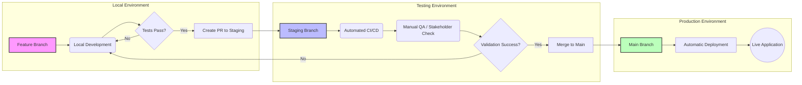
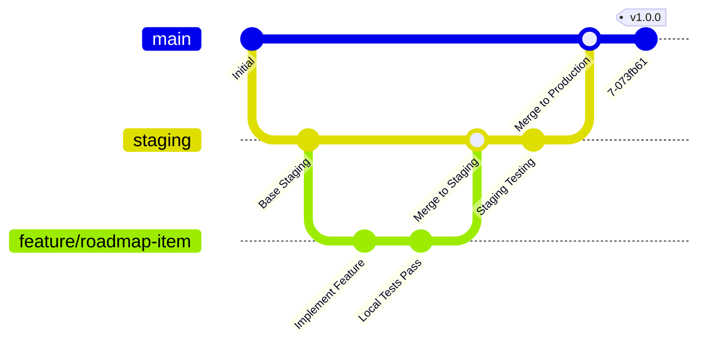

# Development Branching Strategy

This document outlines the standard workflow for feature development, testing, and deployment using GitHub branches. It is the canonical version shared across all AIKYA repositories — `aikya-agent-factory`, `aikya-platform`, `mars`, `mars-standard`, `AIKYA-KG`, and `aikya.bio-website`.

## Visual Workflow

### 1. Environment Promotion Flow
This flowchart shows how code moves from the developer's laptop to our production servers.



### 2. Git Branching Model (GitGraph)
A representation of the commit history and branch relationships.



---

## Branch Definitions

### 1. Feature Branches (`feature/*`)
- **Purpose**: New features and roadmap items.
- **Source**: Always branch off from `staging`.
- **Naming**: `feature/short-description` (e.g., `feature/auth-provider-refactor`).
- **Validation**: Must pass all local tests before merging.

### 2. Bugfix Branches (`bugfix/*`)
- **Purpose**: Non-critical bug fixes addressing issues found in staging or local environments.
- **Source**: Always branch off from `staging`.
- **Naming**: `bugfix/short-description` (e.g., `bugfix/fix-card-aro-resolution`).
- **Validation**: Must pass all local tests and include regression tests before merging.

### 3. Hotfix Branches (`hotfix/*`)
- **Purpose**: Critical bug fixes addressing live issues in production.
- **Source**: Always branch off from `main`.
- **Naming**: `hotfix/short-description` (e.g., `hotfix/login-crash`).
- **Validation**: Must pass all local tests, then merge to *both* `main` and `staging`.

### 4. Chore / Docs / Refactor / Infra Branches
- **Purpose**: `chore/*` for maintenance/housekeeping, `docs/*` for documentation-only changes, `refactor/*` for non-behavioral code restructuring, `infra/*` for CI/CD, deployment, or tooling changes.
- **Source**: Always branch off from `staging`.
- **Naming**: `chore/short-description`, `docs/short-description`, `refactor/short-description`, `infra/short-description`.
- **Validation**: Same as feature branches — must pass all local tests before merging.

### 5. Staging Branch (`staging`)
- **Purpose**: Integration testing and pre-production validation.
- **Source**: Receives merges from `feature/*`, `bugfix/*`, `chore/*`, `docs/*`, `refactor/*`, and `infra/*` branches.
- **Environment**: This branch is deployed to the Staging environment for cross-functional testing.
- **Rule**: Code must be stable and tested before arriving here.

### 6. Production Branch (`main`)
- **Purpose**: Stable production code.
- **Source**: Receives merges from `staging`. Hotfix branches also merge directly here.
- **Environment**: This branch is deployed to Production.
- **Rule**: Only merge into `main` after successful sign-off on Staging, EXCEPT for critical hotfixes.

---

## The Step-by-Step Way of Working

### Step 1: Start Development
Identify the task type and create a new branch from the appropriate source (`staging` for features, bugfixes, chores, docs, refactors, and infra changes; `main` for hotfixes).
```bash
# For Features, Bugfixes, Chores, Docs, Refactors, Infra
git checkout staging
git pull origin staging
git checkout -b feature/your-feature-name # or bugfix/, chore/, docs/, refactor/, infra/

# For Hotfixes
git checkout main
git pull origin main
git checkout -b hotfix/your-hotfix-name
```

### Step 2: Local Testing
Develop your changes and run the test suite locally. Ensure no regressions are introduced.
- Run unit tests.
- Verify agent/service behaviors relevant to your change.
- Check UI consistency (where applicable).

### Step 3: Merge to Staging
Once local testing is successful, create a Pull Request to merge your branch into `staging`. The PR body should reference the issue it closes (e.g., `Closes #42`) where one exists.
- Perform a final self-review.
- Request peer review if applicable.
- Merge the PR once approved and CI is green.

### Step 4: Staging Validation
Once merged to `staging`, the changes must be validated in the integrated environment. This includes:
- Integration tests.
- End-to-end testing (where applicable).
- Stakeholder validation (if required).

### Step 5: Merge to Production
After staging validation is complete and the build is confirmed healthy, merge `staging` into `main`.
```bash
git checkout main
git merge staging
git push origin main
```
*Note: We use tags to mark production releases.*

---

## Enforcement Guardrails

To ensure consistency across the team (and across autonomous/agentic contributors), we have implemented automated guardrails that prevent accidental deviations from this strategy.

### 1. Local Pre-Push Hook
A Git `pre-push` hook is used to:
- **Prevent direct pushes to `main`**: All changes to production must go through a pull request or merge from `staging`.
- **Enforce naming conventions**: Branches that do not follow the `feature/*`, `hotfix/*`, `bugfix/*`, `chore/*`, `docs/*`, `refactor/*`, `infra/*` convention will be rejected locally.

**Installation:**
Run the following command from the repository root:
```bash
bash scripts/install-hooks.sh
```

### 2. GitHub Actions
An automated **Branch Naming Audit** runs on every push and pull request. If a branch name does not follow the required regex (`^(feature|hotfix|bugfix|chore|docs|refactor|infra)/.+`), the CI build will fail, preventing the merge.

---

## Summary Table

| Branch | Description | Target Environment | Stability Level |
| :--- | :--- | :--- | :--- |
| `feature/*` | Roadmap items | Local | Unstable / Work-in-Progress |
| `bugfix/*` | Non-critical bug fixes | Local | Unstable / Work-in-Progress |
| `hotfix/*` | Critical production issues | Local (then Main) | Unstable / Work-in-Progress |
| `chore/*` | Maintenance / housekeeping | Local | Unstable / Work-in-Progress |
| `docs/*` | Documentation-only changes | Local | Unstable / Work-in-Progress |
| `refactor/*` | Non-behavioral restructuring | Local | Unstable / Work-in-Progress |
| `infra/*` | CI/CD, deployment, tooling | Local | Unstable / Work-in-Progress |
| `staging` | Pre-production Integration | Staging | Stable (Testing Candidate) |
| `main` | Production Source of Truth | Production | Highly Stable |
